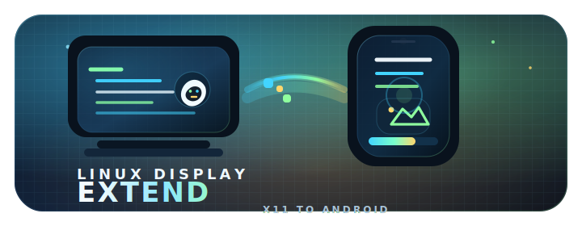

# Linux Display Extend

<p align="center">
  
</p>

Use your Android device as a real extended display for Linux X11 sessions.

[](LICENSE)
[](https://github.com/USKhokhar/linux-display-extend/stargazers)
[](https://github.com/USKhokhar/linux-display-extend/issues)


## What It Does

`linux-display-extend` combines:

- `xrandr` to attach and position an extra display output
- `x11vnc` to stream only that extended desktop region
- an Android VNC client to render and interact with the new display

It is designed for X11 sessions today. Wayland support is not implemented yet.

## Quick Start

Install with the canonical repo-root installer:

```bash
bash <(curl -fsSL https://raw.githubusercontent.com/USKhokhar/linux-display-extend/main/universal_installer.sh)
```

Then validate your machine and launch:

```bash
display-extend doctor
display-extend start
```

On Android:

1. Install a VNC client such as RealVNC Viewer or MultiVNC.
2. Connect to the host and port printed by `display-extend start`.
3. If prompted, use the password stored in `~/.config/linux-display-extend/connection.secret`.

## Why This Release Is Better

- the runtime now respects configured resolution and position
- the tool tracks its own PID, output, and clip geometry instead of killing unrelated `x11vnc` processes
- config is parsed safely instead of being executed as shell
- VNC defaults now use password authentication instead of open `-nopw`
- the installer and package builder now have one canonical source of truth
- the CLI is branded and includes diagnostics, logs, and password management commands

## Commands

```bash
display-extend <command> [options]
```

Core commands:

- `display-extend start`
- `display-extend stop`
- `display-extend restart`
- `display-extend status`
- `display-extend config`

Support commands:

- `display-extend doctor`
- `display-extend logs`
- `display-extend set-password`
- `display-extend install-vnc`
- `display-extend update`
- `display-extend --help`
- `display-extend --version`

Useful start options:

- `--resolution WxH`
- `--position right|left|above|below`
- `--monitor <name>`
- `--port <port>`
- `--bind <addr>`
- `--quality low-bandwidth|balanced|high-quality`
- `--insecure-lan`
- `--debug`

## Support Matrix

Currently supported and expected:

- Linux only
- X11 desktop sessions
- `xrandr`, `x11vnc`, and `cvt` available on the host
- at least one connected monitor plus one usable disconnected output target

Currently not supported:

- Wayland sessions
- multi-device streaming
- encrypted transport without a separate tunnel or network layer

## Repository Layout

- `scripts/display-extend.sh`: canonical runtime source
- `universal_installer.sh`: canonical installer
- `display_extend_package.sh`: canonical Debian package tree builder
- `installer/`: compatibility wrappers around the root scripts
- `.agent/`: caveats, improvements, and agent operating rules
- `docs/`: project documentation for architecture and testing

## Development

Common commands:

```bash
make test
make package
```

See [CONTRIBUTING.md](CONTRIBUTING.md) for contributor workflow, architecture guidance, and pre-PR testing instructions across Linux, macOS, and Windows setups.

Project health files:

- [CODE_OF_CONDUCT.md](CODE_OF_CONDUCT.md)
- [SECURITY.md](SECURITY.md)
- [SUPPORT.md](SUPPORT.md)
- [docs/RELEASE.md](docs/RELEASE.md)

## Troubleshooting

If the session will not start:

1. Run `display-extend doctor`.
2. Confirm you are on X11, not Wayland.
3. Check that `xrandr` shows a connected main monitor and at least one disconnected output.
4. Read the runtime logs with `display-extend logs`.

## License

[MIT](LICENSE)
