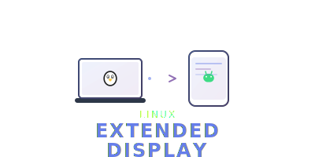

# 🚀 Linux Display Extend

<p align="center">
  
</p>

**Use your Android device as a true extended display for Linux.**

[](LICENSE)
[](https://github.com/USKhokhar/linux-display-extend/stargazers)
[](https://github.com/USKhokhar/linux-display-extend/issues)
[](https://github.com/USKhokhar/linux-display-extend/pulls)
[](https://twitter.com/US_Khokhar)


---

## 🚦 Quick Start

```bash
bash <(curl -fsSL https://raw.githubusercontent.com/USKhokhar/linux-display-extend/main/installer/universal_installer.sh)
```
```bash
display-extend start
```

1. Install a VNC viewer (e.g. RealVNC Viewer) on your Android device.
2. Connect to the IP and port shown in your terminal (`:5900` by default).
3. That's it, your andorid device is now your external monitor!

> 💡 **Tip:** Run `display-extend config` to set your preferred resolution and position.

---

## ✨ Features

- 🖥️ **True Extended Desktop:** Move windows and cursor seamlessly between your main display and Android device
- 🔀 **Zero Mirroring:** Android acts as a real second screen, not a copy
- ⚡ **Universal Installer:** One command sets up everything
- 🐧 **Distro Agnostic:** Ubuntu, Debian, Fedora, Arch, openSUSE, and more
- 🛠️ **Easy Customization:** Interactive or config file

---

## 🛠️ How It Works
- Creates a virtual display on your Linux machine using X11 and xrandr
- Streams the extended desktop region to your Android device over VNC
- Connect using any VNC viewer app on Android (e.g., RealVNC Viewer)

---

## ⚙️ Customization
- Run `display-extend config` to set display resolution and position interactively
- Or edit `~/.config/linux-display-extend/config` manually

---

## 📂 Scripts & Tools
- `scripts/start-monitor.sh`: Minimal script to enable extended display
- `scripts/stop-monitor.sh`: Minimal script to disable extended display
- `installer/display_extend_package.sh`: Build a .deb package for Ubuntu
- `installer/universal_installer.sh`: Cross-distro installer

---

## 🖥️ `display-extend` Commands

All commands are run as:
```bash
display-extend <command> [options]
```

- `display-extend start` — Launch the extended display and VNC server
- `display-extend stop` — Stop the extended display and VNC server
- `display-extend status` — Show current status of the extended display
- `display-extend config` — Interactive configuration for resolution/position
- `display-extend install-vnc` — (Re)install and configure VNC dependencies
- `display-extend help` or `display-extend --help` — Show help and usage

---

## 🩹 Troubleshooting

**`display-extend: command not found` after install?**

If you run the installer and get `command not found: display-extend` after installation, this usually means the installer could not prompt for your sudo password in your shell (common with one-line installs or some terminal setups).

To fix instantly, run these commands manually:

```bash
sudo curl -fSL https://raw.githubusercontent.com/USKhokhar/linux-display-extend/main/scripts/display-extend.sh -o /usr/local/bin/display-extend
sudo chmod +x /usr/local/bin/display-extend
```

Now you should be able to run `display-extend --help` from any terminal.

If you still have issues, check your PATH includes `/usr/local/bin` or try restarting your terminal.

---

## 🤝 Contributing
See [CONTRIBUTING.md](CONTRIBUTING.md) for guidelines. PRs and ideas are welcome!

---

## 📄 License
[MIT](LICENSE)

Made with ❤️ by [USKhokhar](https://github.com/USKhokhar) · [@US_Khokhar](https://twitter.com/US_Khokhar) · [Portfolio](https://uskhokhar.vercel.app)
See [CONTRIBUTING.md](CONTRIBUTING.md) for guidelines.

## License
[MIT](LICENSE)